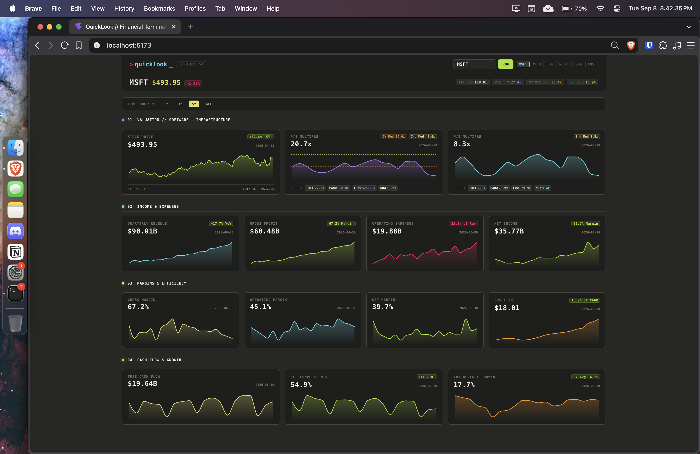

# QuickLook



```bash
./start.sh
```

---

### 🔑 API Keys (Free)

QuickLook includes pre-cached historical data for top tickers (e.g. `MSFT`, `AAPL`, `NVDA`, `META`). To fetch live data for new tickers, you need two free API keys:

1. **[Alpha Vantage API Key](https://www.alphavantage.co/support/#api-key)** — Standardized financial statements & quarterly filings.
2. **[Finnhub API Token](https://finnhub.io/register)** — Dynamic competitor peer discovery.

#### How to Inject Keys

Create a `.env` file in the root directory (or copy from `.env.example`):

```bash
cp .env.example .env
```

Add your keys:
```env
ALPHAVANTAGE_KEY=your_alphavantage_key
FINNHUB_TOKEN=your_finnhub_token
```

*(Or export them directly in your shell: `export ALPHAVANTAGE_KEY=...` and `export FINNHUB_TOKEN=...`).*

#### What if you don't have keys?
- **Pre-cached tickers** (`MSFT`, `AAPL`, `NVDA`, `META`, `GOOGL`, etc.) and all **Yahoo Finance price charts & industry medians** work immediately with zero keys.
- Live statement queries for new tickers will display an in-app notice until keys are provided.
