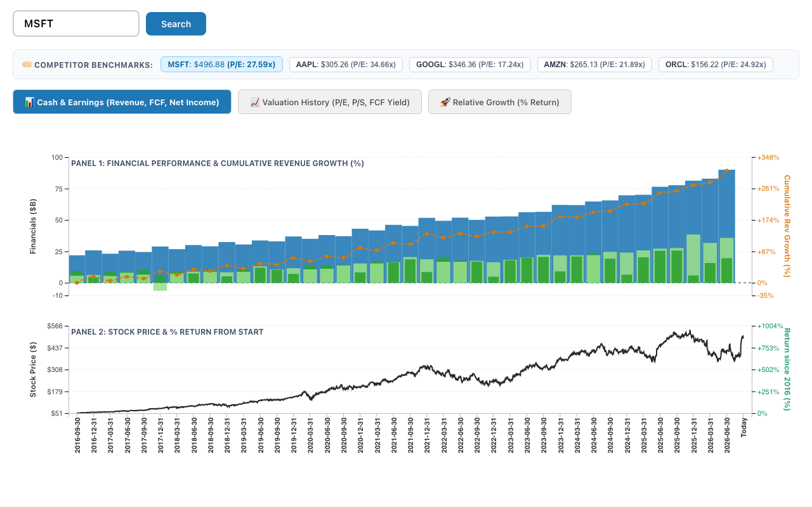
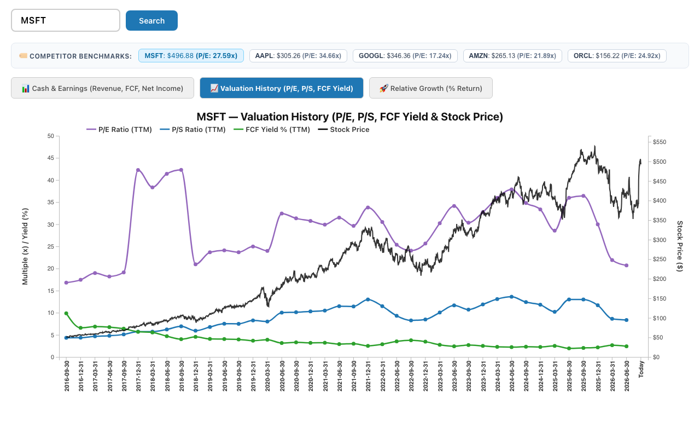
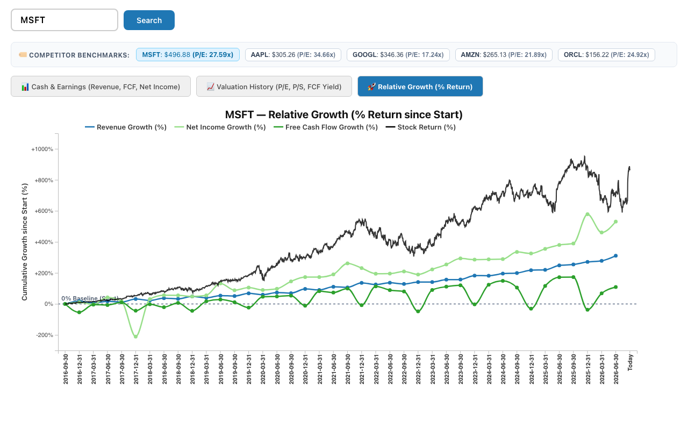

# QuickLook Finance Dashboard

A fast, interactive stock & financial performance dashboard built with **React**, **D3.js**, **Python (Flask)**, and **Alpha Vantage**.

---

## 📸 Dashboard Views

### 1. 📊 Cash & Earnings (Revenue, FCF, Net Income vs Stock Price)
Dual-pane visualization comparing quarterly Revenue, Net Income, Free Cash Flow, and 10-year stock price history.


### 2. 📈 Valuation History (P/E, P/S, FCF Yield & Stock Price)
Historical P/E Ratio, P/S Ratio, and Free Cash Flow Yield tracking over time alongside share prices.


### 3. 🚀 Relative Growth (% Return since Start)
Rebased percentage growth curves starting at `0% Baseline` to compare fundamental performance directly against share price returns.


### 4. 🔬 DCF Historical Drivers (EPS, Growth %, P/E Ratio)
Synchronized 3-panel valuation drivers view designed specifically to evaluate historical inputs for DCF modeling:
* **Panel 1: 💵 EPS History ($ TTM)** — Trailing twelve months earning power progression.
* **Panel 2: 🚀 EPS YoY Growth Rate (%)** — Quarter-by-quarter YoY growth trajectory with a `0% Baseline` and 5Y CAGR benchmark.
* **Panel 3: 🏛️ Historical P/E Multiple (x)** — Multiple expansion/compression history with 5-Year Median P/E reference anchor.

### 5. 🎯 DCF Valuation Calculator
Interactive valuation model projecting 5-Year / 10-Year compounding returns. Displays target entry buy prices across hurdle rates (8%, 10%, 12%, 15%, 20%), expected annual return (CAGR) from today's price, visual compounding trajectory graph, and a growth rate vs exit multiple sensitivity heatmap.

---

## 🌟 Key Features

* 📊 **Multi-Tab Visualization:** Instantly toggle between Cash & Earnings, Valuation History, Relative Growth Return, DCF Historical Drivers, and DCF Valuation Calculator.
* 🏷️ **Interactive Competitor Benchmarks:** Clickable peer ticker pills (e.g. `AAPL`, `GOOGL`, `AMZN`, `ORCL`) to compare P/E ratios and switch target companies instantly.
* 🎯 **Dynamic Tooltips & Guidelines:** High-precision crosshairs, explicit zero baselines, and complete dollar/percentage breakdowns on hover.
* ⚡ **Optimized Parallel Data Engine:** Concurrent API fetching (`ThreadPoolExecutor`) and disk caching (`financial_cache.db`) for sub-second reloads.

---

## 🚀 Quick Start

Start both the backend API server (`http://127.0.0.1:5001`) and frontend app (`http://localhost:5173`) with a single command:

```bash
./start.sh
```

> **Note:** Pressing `Ctrl+C` cleanly shuts down both frontend and backend processes simultaneously.

---

## 🛠 Tech Stack

* **Frontend:** React, D3.js, Vite, Vanilla CSS
* **Backend:** Python 3, Flask, Pandas, NumPy, Requests
* **Data Sources:** Alpha Vantage API (Quarterly Reports & Valuation)
* **Storage & Caching:** SQLite Disk Cache (`cache/financial_cache.db`)
